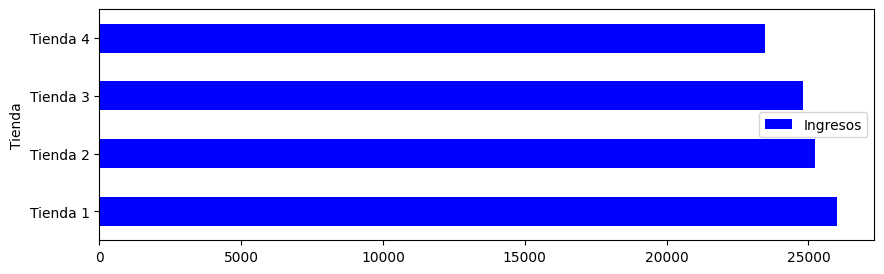

# 📊 Análisis de Datos para Decisión Estratégica de Tienda
## Proyecto: Optimización de Venta para el Señor Juan

---

## 🧠 Descripción del Proyecto

El Señor Juan desea determinar **qué tienda es la más conveniente para vender** basándose en datos reales.

Para apoyarlo en esta decisión, se realizó un análisis exploratorio de datos utilizando:

- Python
- Pandas
- Matplotlib
- Jupyter Notebook

El análisis combina métricas financieras y de experiencia del cliente para emitir una recomendación estratégica basada en datos.

---

## 🎯 Objetivo

Determinar cuál tienda ofrece la mejor combinación de:

- 📈 Ingresos
- ⭐ Satisfacción del cliente
- 📦 Volumen de ventas
- 🏷️ Productos más vendidos

---

## 📊 1️⃣ Ingresos por Tienda

Se compararon los ingresos totales de las cuatro tiendas.

Esta gráfica permite identificar cuál tienda genera mayor rentabilidad.

---

## ⭐ 2️⃣ Satisfacción Promedio por Tienda

Se calculó el promedio de calificaciones (escala 1–5 estrellas) para evaluar la experiencia del cliente.

Una alta satisfacción indica mayor probabilidad de recompra y sostenibilidad a largo plazo.

---

## 🏷️ 3️⃣ Ventas por Categoría

Se analizó el volumen de productos vendidos por categoría.

Este análisis permite identificar qué segmentos son más fuertes en cada tienda.

---

## 🔥 4️⃣ Productos Más Vendidos

Se identificaron los productos con mayor frecuencia de venta en la tienda con mejor desempeño.

Esto ayuda a detectar productos estrella y oportunidades de optimización de inventario.

---

## 📈 Metodología

1. Limpieza y preparación de datos.
2. Agrupación y agregación con Pandas.
3. Visualización de métricas clave.
4. Comparación estratégica entre tiendas.
5. Evaluación de rentabilidad y satisfacción.

---

## 🏆 Conclusión Estratégica

La decisión no se basa únicamente en volumen de ventas o satisfacción individual, sino en el equilibrio entre:

- Rentabilidad
- Satisfacción del cliente
- Desempeño por categoría
- Productos con mayor rotación

La tienda recomendada es aquella que combina **altos ingresos con alta satisfacción**, garantizando sostenibilidad y crecimiento futuro.

---

## 🛠️ Tecnologías Utilizadas

- Python
- Pandas
- Matplotlib
- Jupyter Notebook

---

## 🚀 Próximas Mejoras

- Incorporar análisis de margen de ganancia
- Implementar métricas como Customer Lifetime Value (CLV)
- Crear dashboard interactivo
- Aplicar modelos predictivos de ventas

---

## 👩‍💻 Autor

Proyecto desarrollado como práctica de análisis de datos aplicado a decisiones empresariales reales.

---

⭐ Si este proyecto te pareció interesante, ¡no olvides darle una estrella al repositorio!
